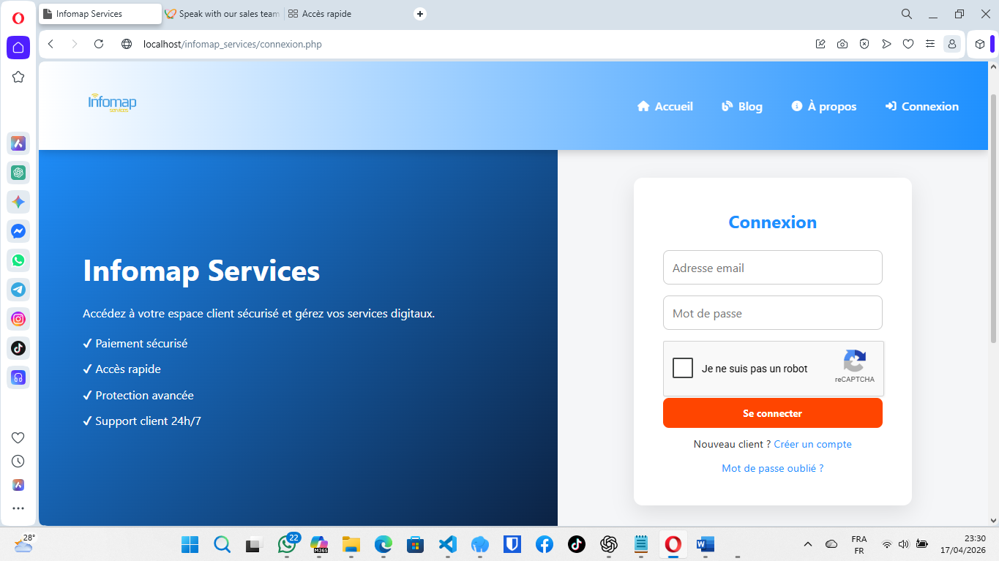
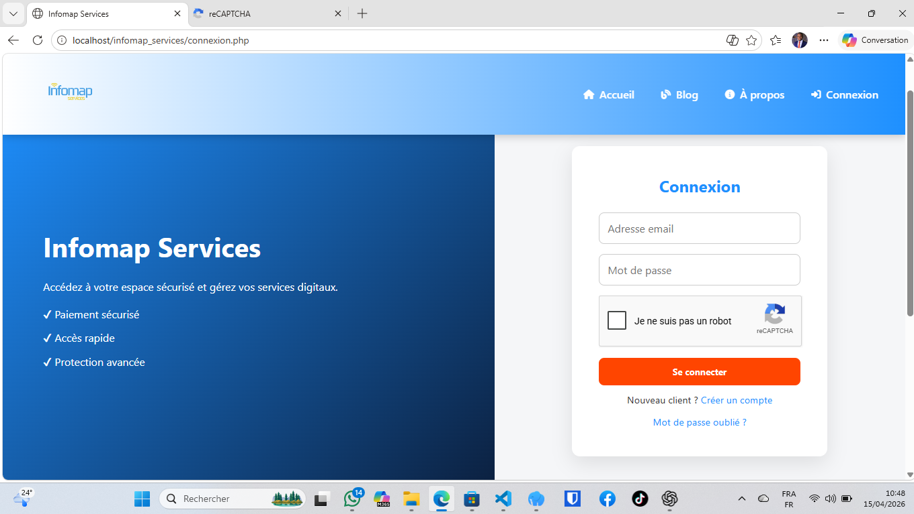

# infomap-app-public
<p align="center">
  
</p>

<h1 align="center">🚀 Infomap App</h1>
<h3 align="center">Solutions Digitales Innovantes pour l’Afrique</h3>

<p align="center">
  
  
  
  
</p>

---

## 🌍 À propos du projet

**Infomap App** est une plateforme digitale développée avec **Laravel** par Infomap Services.

Elle est conçue pour moderniser la gestion des services numériques et des opérations clients en Afrique, dans un environnement sécurisé, structuré et évolutif.

La plateforme permet de centraliser :

- Les services digitaux  
- Les commandes et demandes clients  
- Les transactions et paiements numériques  
- Les opérations administratives internes  

---

## 🎯 Objectifs

- Digitaliser la gestion des services clients  
- Centraliser les opérations dans une seule plateforme  
- Automatiser les processus métier  
- Améliorer la performance des services  
- Garantir la sécurité des données  
- Faciliter la transformation digitale en Afrique  

---

## ⚙️ Fonctionnalités principales

- 🔐 Authentification sécurisée (Laravel Auth)  
- 👤 Gestion des utilisateurs (clients / administrateurs)  
- 🛒 Gestion des services et commandes  
- 💳 Intégration des paiements (Mobile Money / API)  
- 📊 Tableau de bord interactif  
- 📩 Système de suivi et support client  
- 🧾 Historique des transactions  
- ⚡ Architecture évolutive et modulaire  

---

## 🛠️ Technologies utilisées

### Backend
- Laravel (PHP Framework)
- PHP 8+
- Eloquent ORM

### Frontend
- Blade Templates (Laravel)
- HTML5 / CSS3
- JavaScript

### Base de données
- MySQL / MariaDB
- Migrations Laravel

### Outils
- Composer
- Artisan CLI
- Git & GitHub
- VS Code / Laragon

---

## 📁 Architecture du projet

```text id="structure_final_001"
app/
├── Http/
│   ├── Controllers/
│   │   ├── Auth/
│   │   ├── DashboardController.php
│   │   ├── ServiceController.php
│   │
├── Models/
│   ├── User.php
│   ├── Service.php
│   ├── Order.php

resources/
├── views/
│   ├── auth/
│   ├── dashboard/
│   ├── services/
│   ├── layouts/

routes/
├── web.php

database/
├── migrations/
├── seeders/
├── factories/

public/
├── index.php
├── assets/
│   ├── css/
│   ├── js/
│   ├── images/

storage/
├── app/
├── logs/
├── framework/

config/
├── app.php
├── database.php

tests/
├── Feature/
├── Unit/

.env
artisan
composer.json
package.json
README.md
---

## 📸 Captures d’écran

### 🔐 Page de connexion


### 📝 Page d’inscription


---

## 🔒 Accès au code source

Le code source de ce projet est **privé** et n’est pas accessible publiquement.

Pour toute collaboration ou demande professionnelle, veuillez contacter :

📧 infomapservicesagence@gmail.com  

---

## 🤝 Collaboration

Ce projet est ouvert à la collaboration avec :

- Développeurs  
- Partenaires techniques  
- Institutions publiques et privées  
- Projets de transformation digitale  

---

## 🏢 Informations sur l’entreprise

Infomap Services  
Entreprise de solutions numériques basée en République Démocratique du Congo  
Spécialisée dans :

- Développement de logiciels  
- Solutions web  
- Systèmes de gestion  
- Transformation digitale  

---

## 📬 Contact

Email : infomapservicesagence@gmail.com  

---

## © 2026 Infomap Services  
Tous droits réservés.
